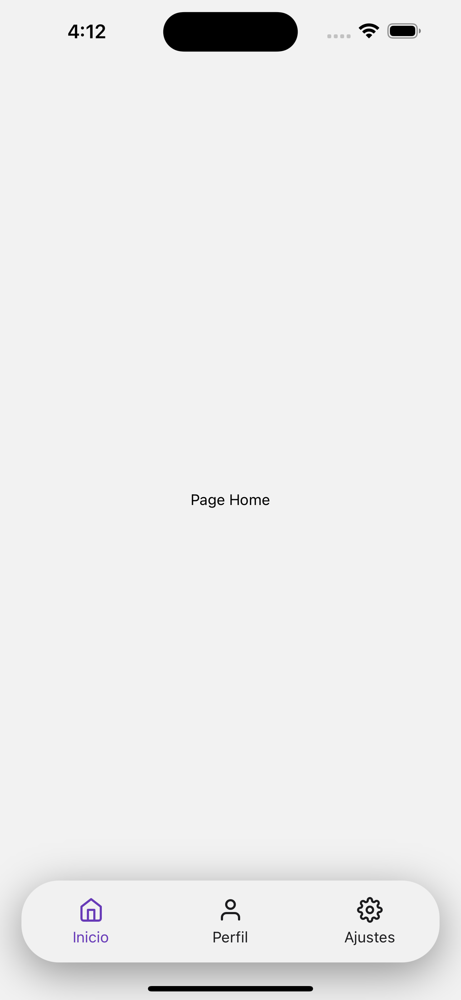
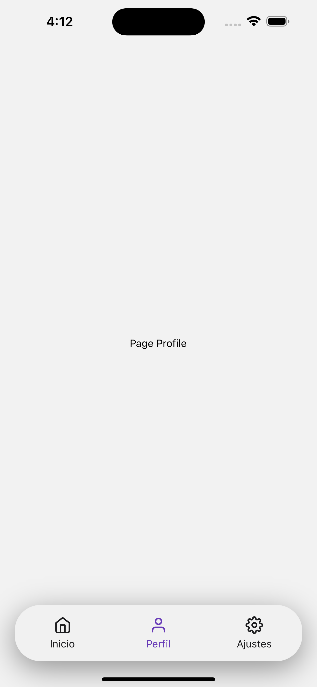
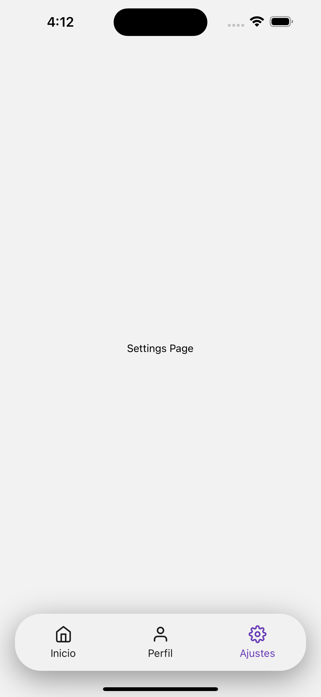

# TabBar-Bottom-Custom
<h1 align="center">
	
</h1>

<h3 align="center">
  Tabs Bottom Custom
</h3>

<p align="center">
  

  

  

  

  
</p>

<p align="center">
  <a href="#-about-the-project">About The Project</a>&nbsp;&nbsp;&nbsp;|&nbsp;&nbsp;&nbsp;
  <a href="#-technologies">Technologies</a>&nbsp;&nbsp;&nbsp;|&nbsp;&nbsp;&nbsp;
  <a href="#-getting-started">Getting Started</a>&nbsp;&nbsp;&nbsp;|&nbsp;&nbsp;&nbsp;
  <a href="#contact">Contact</a>&nbsp;&nbsp;&nbsp;|&nbsp;&nbsp;&nbsp;
  <a href="#-license">License</a>
</p>

## 👨🏻‍💻 About the project

<p>
This is a mobile app built on expo with react native that contains a custom bottom tab bar component with an innovative design to use in any app.
In addition to a structure to adapt screen navigation if necessary, optimizing actions and concentrating everything in a component called a router.
</p>

## Screenshots
<div>
	
	
	
</div>

## 🚀 Technologies

Main technologies that I used to develop this frontend app

- [Expo](https://docs.expo.io)
- [ReactJS](https://nodejs.org/en)
- [TypeScript](https://www.typescriptlang.org)
- [React-Native](https://reactnative.dev/docs/getting-started)
- [VS Code](https://code.visualstudio.com)
- [React Native Navigation](https://reactnavigation.org/)

## 💻 Getting started

### Requirements

- [Node.js](https://nodejs.org/en/)
- [Yarn](https://classic.yarnpkg.com/) or [npm](https://www.npmjs.com/)
- [expo-cli](https://docs.expo.dev/)

**1. Clone the project**
```bash
git clone https://github.com/Alfred-developer/TabBar-Bottom-Custom.git
```
**2. Access the folder**
```bash
cd TabBar-Bottom-Custom
```
**3. Install Expo Cli**
```bash
npm install -g expo-cli exp
```
**4. Install dependencies**
```bash
npm i
```
**5. Run app**
```bash
npx expo start
```
<!-- LICENSE -->
## License

Distributed under the MIT License. See LICENSE for more information.

## Contact

Alfred-developer - anavarrolga@gmail.com


Project Link https://github.com/Alfred-developer/TabBar-Bottom-Custom.git
